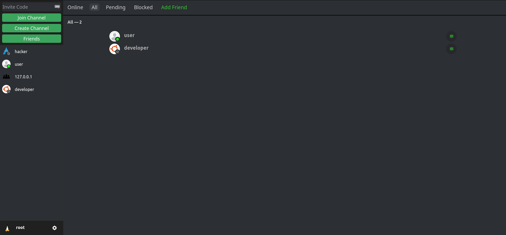
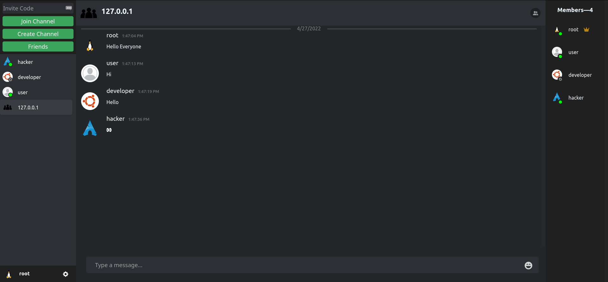

# Chatapp



more [images](images)

## Features
- Authentication
- Messages
    - Create
    - Edit
    - Delete
- DMs
- Channel
    - Owner can delete other user's message
    - Create / Delete invites
    - Kick / Ban Member
    - Unban
- Friends
	- Add / Accept
	- Remove / Decline

## Setup Server

In server folder

### Example `.env`

```bash
export SERVER_HOST="127.0.0.1"
export SERVER_PORT="5000"
export JWT_SECRET="some_random_string"
export PG_HOST="127.0.0.1"
export PG_PORT="5432"
export PG_USER="database_username"
export PG_PASSWORD="database_password"
export PG_DATABASE="chatapp"
```

### Run Server

```bash
go build
source .env
./Chatapp
```

### Server Dependency

```bash
go get .
```

## Setup Database
### Postgres Database Docker
```bash
docker-compose up -d
```

## Setup Web Client

In web folder

### Web Client Dependency

```bash
npm ci
```

### Run Web Client

```bash
npm start
```
